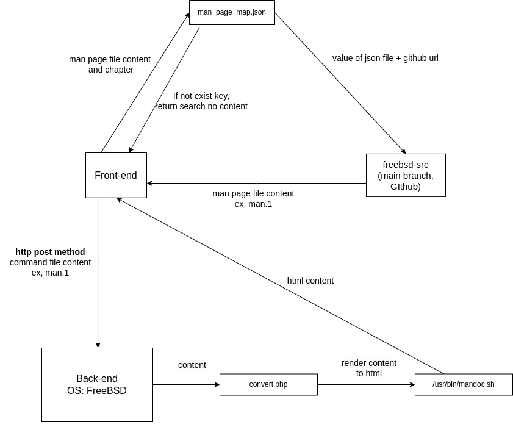

# FreeBSD online man page editor
An online man page editor for FreeBSD man page. This project should work on FreeBSD server.

This is the workflow of this project.

# Package(freebsd pkg)
1. Apache24
2. php81
3. mod_php81

## Contributing
Pull requests are welcome. For major changes, please open an issue first to discuss what you would like to change.

## License
[MIT](https://choosealicense.com/licenses/mit/)
